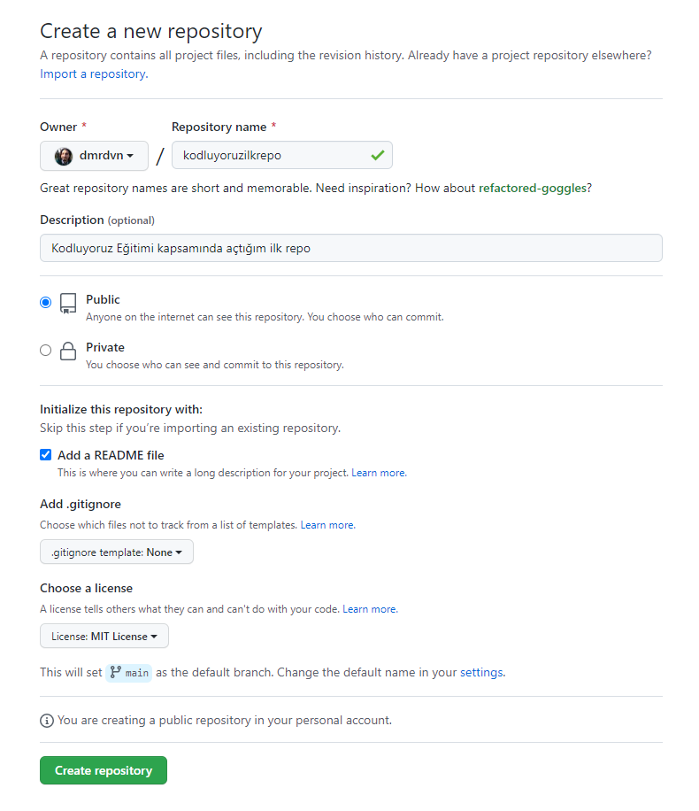

# 🏡 Kodluyoruz İlk Repo
---
Bu repo Kodluyoruz Front-End Eğitiminde oluşturduğumuz ilk repo. İçerisinde bir adet README dosyası, bir adet de index.html barındırıyor.



## Installation
---
Öncelikle projeyi clonelayın. (Buraya sizin reponuzdan aldığınız link gelecek)

```bash
git clone https://github.com/cengizcmataraci/kodluyoruzilkrepo.git
```

## Usage 
---
Projeyi cloneladıktan sonra Visual Studio Code programında açınız.

Linux için:

```linux
cd kodluyoruzilkrepo
code .
```

## Contributing
---
Pull requestler kabul edilir. Büyük değişiklikler için, lütfen önce neyi değiştirmek istediğinizi tartışmak için bir konu açınız.
## License
---
💙 [MIT](https://choosealicense.com/licenses/mit/)